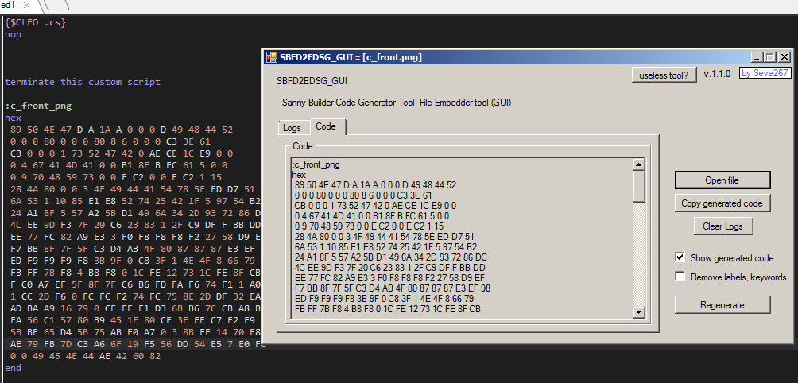

# Sanny Builder IDE tool: Binary data embedder & Code generator tool.

Made in C# 😀 GUI Based IDE tool.

This tool is useful for embedding a binary file into the code.
This tool is a code generator.

**Pre-release build: [#v.1.1.0-alpha.1](https://github.com/Seve2670/SBFD2EDSG_GUI/releases/tag/v1.1.0-alpha.1)

Why this repo called "SBFD2EDSG"? What's the accronym of this?\
So, this is what i called: *Sanny Builder File Data TO Embedded Data Script Generator*\
so that's the generic name.
 
